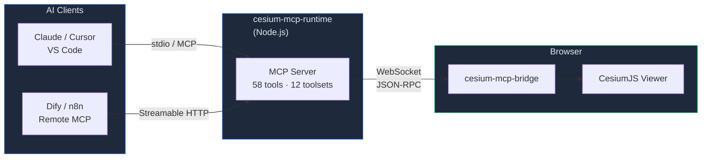

<div align="center">
  

  <h1>Cesium MCP</h1>

  <p><strong>AI-Powered 3D Globe Control via Model Context Protocol</strong></p>

  <p>Connect any MCP-compatible AI agent to <a href="https://cesium.com/">CesiumJS</a> — camera, layers, entities, spatial analysis, all through natural language.</p>

  <p>
    <a href="https://gaopengbin.github.io/cesium-mcp/">Website</a> &middot;
    <a href="README.zh-CN.md">中文</a> &middot;
    <a href="https://gaopengbin.github.io/cesium-mcp/guide/getting-started.html">Getting Started</a> &middot;
    <a href="https://gaopengbin.github.io/cesium-mcp/api/bridge.html">API Reference</a>
  </p>

  <p>
    <a href="LICENSE"></a>
    <a href="https://github.com/gaopengbin/cesium-mcp/actions/workflows/ci.yml"></a>
    <a href="https://github.com/gaopengbin/cesium-mcp/stargazers"></a>
    <a href="https://www.npmjs.com/package/cesium-mcp-runtime"></a>
  </p>

  <p>
    <a href="https://www.npmjs.com/package/cesium-mcp-bridge"></a>
    <a href="https://www.npmjs.com/package/cesium-mcp-runtime"></a>
    <a href="https://www.npmjs.com/package/cesium-mcp-dev"></a>
  </p>

  <p>
    <a href="https://img.shields.io/badge/tools-58-12B76A?style=flat-square"></a>
    <a href="https://img.shields.io/badge/toolsets-12-16B364?style=flat-square"></a>
    <a href="https://img.shields.io/badge/transport-stdio%20%7C%20http-7A5AF8?style=flat-square"></a>
    <a href="https://img.shields.io/badge/i18n-en%20%7C%20zh--CN-F79009?style=flat-square"></a>
  </p>

  <p>
    <a href="https://glama.ai/mcp/servers/gaopengbin/cesium-mcp"></a>
    <a href="https://mcpservers.org/servers/gaopengbin/cesium-mcp"></a>
    <a href="https://smithery.ai/server/gaopengbin/cesium-mcp-runtime"></a>
  </p>
</div>

---

## Demo

https://github.com/user-attachments/assets/8a40565a-fcdd-47bf-ae67-bc870611c908

## Packages

| Package | Description | npm |
|---------|-------------|-----|
| [cesium-mcp-bridge](packages/cesium-mcp-bridge/) | Browser SDK — embeds in your CesiumJS app, receives commands via WebSocket | [](https://www.npmjs.com/package/cesium-mcp-bridge) |
| [cesium-mcp-runtime](packages/cesium-mcp-runtime/) | MCP Server (stdio + HTTP) — 58 tools (12 toolsets) + 2 resources, dynamic discovery | [](https://www.npmjs.com/package/cesium-mcp-runtime) |
| [cesium-mcp-dev](packages/cesium-mcp-dev/) | IDE MCP Server — CesiumJS API helper for coding assistants | [](https://www.npmjs.com/package/cesium-mcp-dev) |

## Architecture



## Quick Start

### 1. Install the bridge in your CesiumJS app

```bash
npm install cesium-mcp-bridge
```

```js
import { CesiumBridge } from 'cesium-mcp-bridge';

const bridge = new CesiumBridge(viewer);
```

### 2. Start the MCP runtime

```bash
# stdio mode (default — for Claude Desktop, VS Code, Cursor)
npx cesium-mcp-runtime

# HTTP mode (for Dify, remote/cloud MCP clients)
npx cesium-mcp-runtime --transport http --port 3000
```

### 3. Connect your AI agent

Add to your MCP client config (e.g. Claude Desktop):

```json
{
  "mcpServers": {
    "cesium": {
      "command": "npx",
      "args": ["-y", "cesium-mcp-runtime"]
    }
  }
}
```

Now ask your AI: *"Fly to the Eiffel Tower and add a red marker"*

## 58 Available Tools

Tools are organized into **12 toolsets**. Default mode enables 4 core toolsets (~31 tools). Set `CESIUM_TOOLSETS=all` for everything, or let the AI discover and activate toolsets dynamically at runtime.

> **i18n**: Tool descriptions default to English. Set `CESIUM_LOCALE=zh-CN` for Chinese.

| Toolset | Tools |
|---------|-------|
| **view** (default) | `flyTo`, `setView`, `getView`, `zoomToExtent`, `saveViewpoint`, `loadViewpoint`, `listViewpoints`, `exportScene` |
| **entity** (default) | `addMarker`, `addLabel`, `addModel`, `addPolygon`, `addPolyline`, `updateEntity`, `removeEntity`, `batchAddEntities`, `queryEntities`, `getEntityProperties` |
| **layer** (default) | `addGeoJsonLayer`, `listLayers`, `removeLayer`, `clearAll`, `setLayerVisibility`, `updateLayerStyle`, `getLayerSchema`, `setBasemap` |
| **interaction** (default) | `screenshot`, `highlight`, `measure` |
| camera | `lookAtTransform`, `startOrbit`, `stopOrbit`, `setCameraOptions` |
| entity-ext | `addBillboard`, `addBox`, `addCorridor`, `addCylinder`, `addEllipse`, `addRectangle`, `addWall` |
| animation | `createAnimation`, `controlAnimation`, `removeAnimation`, `listAnimations`, `updateAnimationPath`, `trackEntity`, `controlClock`, `setGlobeLighting` |
| tiles | `load3dTiles`, `loadTerrain`, `loadImageryService`, `loadCzml`, `loadKml` |
| trajectory | `playTrajectory` |
| heatmap | `addHeatmap` |
| scene | `setSceneOptions`, `setPostProcess` |
| geolocation | `geocode` |

> **Relationship with CesiumGS official MCP servers**: The `camera`, `entity-ext`, and `animation` toolsets natively fuse capabilities from [CesiumGS/cesium-mcp-server](https://github.com/CesiumGS/cesium-mcp-server) (Camera Server, Entity Server, Animation Server) into this project's unified bridge architecture. This means you get all official functionality plus additional tools — in a single MCP server, without running multiple processes.

## Examples

See [examples/minimal/](examples/minimal/) for a complete working demo.

## Development

```bash
git clone https://github.com/gaopengbin/cesium-mcp.git
cd cesium-mcp
npm install
npm run build
```

## Version Policy

Version format: `{CesiumMajor}.{CesiumMinor}.{MCPPatch}`

| Segment | Meaning | Example |
|---------|---------|--------|
| `1.139` | Tracks CesiumJS version — built & tested against Cesium `~1.139.0` | `1.139.8` → Cesium 1.139 |
| `.8` | MCP patch — independent iterations for new tools, bug fixes, docs | `1.139.7` → `1.139.8` |

When CesiumJS releases a new minor version (e.g. 1.140), we will bump accordingly: `1.140.0`.

## Related Projects

- [mapbox-mcp](https://github.com/gaopengbin/mapbox-mcp) — AI control for Mapbox GL JS
- [openlayers-mcp](https://github.com/gaopengbin/openlayers-mcp) — AI control for OpenLayers

## Star History

<a href="https://star-history.com/#gaopengbin/cesium-mcp&Date">
 <picture>
   <source media="(prefers-color-scheme: dark)" srcset="https://api.star-history.com/svg?repos=gaopengbin/cesium-mcp&type=Date&theme=dark" />
   <source media="(prefers-color-scheme: light)" srcset="https://api.star-history.com/svg?repos=gaopengbin/cesium-mcp&type=Date" />
   
 </picture>
</a>

## License

[MIT](LICENSE)
