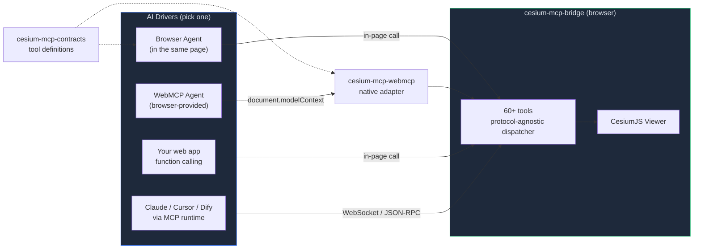

<div align="center">
  <p><strong>The minimum-overhead way to add AI commands to CesiumJS</strong></p>

  <p><a href="packages/cesium-mcp-bridge/">cesium-mcp-bridge</a> is the protocol-agnostic Cesium command executor. Separate adapters expose it to <strong>browser-only agents</strong>, <strong>WebMCP browser agents</strong>, <strong>function calling</strong>, or <strong>MCP</strong> — your choice.</p>

  <p>Four integration paths: <a href="examples/browser-agent/">Browser Agent</a> (simplest, zero backend) · WebMCP (page-local browser tools) · function calling (embed in your web app) · <a href="packages/cesium-mcp-runtime/">MCP runtime</a> (Claude Desktop / Cursor / Dify)</p>

  <p><a href="https://cesium-browser-agent.pages.dev/"><strong>Try it now</strong></a> — open the live browser demo, no install, no signup.</p>

  <p>
    <a href="https://gaopengbin.github.io/cesium-mcp/">Website</a> &middot;
    <a href="README.zh-CN.md">中文</a> &middot;
    <a href="https://gaopengbin.github.io/cesium-mcp/guide/getting-started.html">Getting Started</a> &middot;
    <a href="https://gaopengbin.github.io/cesium-mcp/api/bridge.html">API Reference</a>
  </p>

  <p>
    <a href="LICENSE"></a>
    <a href="https://github.com/gaopengbin/cesium-mcp/actions/workflows/ci.yml"></a>
    <a href="https://github.com/gaopengbin/cesium-mcp/stargazers"></a>
    <a href="https://www.npmjs.com/package/cesium-mcp-runtime"></a>
  </p>

  <p>
    <a href="https://www.npmjs.com/package/cesium-mcp-bridge"></a>
    <a href="https://www.npmjs.com/package/cesium-mcp-runtime"></a>
    <a href="https://www.npmjs.com/package/cesium-mcp-dev"></a>
  </p>
</div>

---

## Demo

https://github.com/user-attachments/assets/8a40565a-fcdd-47bf-ae67-bc870611c908

## Packages & Entry Points

| Module | Role | Status | Links |
|--------|------|--------|-------|
| **cesium-mcp-contracts** | Transport-neutral names, descriptions, and JSON Schemas for browser tools | New shared layer | [source](packages/cesium-mcp-contracts/) |
| **cesium-mcp-bridge** | Protocol- and transport-free Cesium command executor (60+ commands) | Mainline, actively iterated | [](https://www.npmjs.com/package/cesium-mcp-bridge) · [source](packages/cesium-mcp-bridge/) |
| **cesium-mcp-webmcp** | Native `document.modelContext` adapter for Cesium tool contracts | New browser adapter | [source](packages/cesium-mcp-webmcp/) |
| **examples/webmcp-integration** | Focused npm + Vite integration without a chat UI or MCP server | Developer example | [example](examples/webmcp-integration/) |
| **examples/browser-agent** | Browser-only AI agent with automatic WebMCP exposure | Recommended | [example](examples/browser-agent/) · [live demo](https://cesium-browser-agent.pages.dev/) |
| **cesium-mcp-runtime** | MCP server (stdio + HTTP) | Stable, slow updates | [](https://www.npmjs.com/package/cesium-mcp-runtime) · [source](packages/cesium-mcp-runtime/) |
| **cesium-mcp-dev** | CesiumJS API knowledge base for coding assistants | Maintained | [](https://www.npmjs.com/package/cesium-mcp-dev) · [source](packages/cesium-mcp-dev/) |

> **Which one?** Personal project or quick try → browser-agent. Let a compatible browser agent discover page-local Cesium tools → WebMCP. Existing web app embedding an AI assistant → bridge + your own function calling. Calling from Claude Desktop / Cursor / Dify → MCP runtime.

## Architecture



The bridge remains the execution core, while contracts and protocol adapters stay separate. Pick whichever driver matches your scenario — they all reach the same Cesium command layer. On WebMCP-capable browsers, `cesium-mcp-webmcp` can expose 61 browser-safe commands in 12 selectable toolsets through `document.modelContext` without adding an MCP transport or backend server.

## Quick Start

### Path 0 — Try in 30 seconds (browser agent, recommended)

Open the [live demo](https://cesium-browser-agent.pages.dev/) and ask—the hosted model is ready without a browser API key:
> *"Fly to the Eiffel Tower and drop a red marker"*

Fork the [examples/browser-agent](examples/browser-agent/) folder to deploy your own.

### Path 1 — Expose Cesium tools through WebMCP (Chrome 149+ experimental)

The browser-agent example automatically registers all 61 browser-safe page tools when `document.modelContext` is available. Its built-in chat uses automatic toolset routing to keep each normal request at 20 tools or fewer, while still offering explicit core, single-toolset, and all-61 modes:

```bash
npm run build -w packages/cesium-mcp-bridge
npm run build -w packages/cesium-mcp-webmcp
npx serve . -l 4173
```

Open `http://localhost:4173/examples/browser-agent/`, click **Start**, then inspect or execute the tools in DevTools → Application → WebMCP. Enable `#enable-webmcp-testing` and `#devtools-webmcp-support` in `chrome://flags` for local testing.

Application developers install the adapter separately. End users only open the integrated website; they do not install npm packages or run an MCP server.

```bash
npm install cesium cesium-mcp-bridge cesium-mcp-webmcp
```

```js
import { CesiumBridge } from 'cesium-mcp-bridge'
import { registerCesiumWebMcp } from 'cesium-mcp-webmcp'

const bridge = new CesiumBridge(viewer)
const registration = await registerCesiumWebMcp(bridge, {
  toolsets: 'all',
  excludeTools: ['geocode'], // add your own browser geocoder to expose this tool
})

// Later, if the page is unmounted:
registration.unregister()
```

See the [WebMCP adapter API](packages/cesium-mcp-webmcp/README.md) for custom integrations.
For a complete npm + Vite application, start from the [WebMCP integration example](examples/webmcp-integration/).

### Path 2 — Embed in your own web app (function calling)

```bash
npm install cesium-mcp-bridge
```

```js
import { CesiumBridge } from 'cesium-mcp-bridge';

const bridge = new CesiumBridge(viewer);
// Then: send the bridge's tool schema to any LLM that supports function/tool calling,
// route the model's tool calls to bridge.execute(name, params).
```

See [examples/browser-agent/index.html](examples/browser-agent/index.html) for a complete loop with OpenAI-compatible APIs.

### Path 3 — Use from Claude Desktop / Cursor / Dify (MCP)

Install bridge as in Path 2, then start the MCP runtime:

```bash
# stdio mode (Claude Desktop, VS Code, Cursor)
npx cesium-mcp-runtime

# HTTP mode (Dify, remote/cloud MCP clients)
npx cesium-mcp-runtime --transport http --port 3000
```

MCP client config:

```json
{
  "mcpServers": {
    "cesium": {
      "command": "npx",
      "args": ["-y", "cesium-mcp-runtime"]
    }
  }
}
```

## 62 Available Command Tools

Tools are organized into **12 toolsets**. Default mode enables 4 core toolsets (30 tools). Set `CESIUM_TOOLSETS=all` for everything, or let the AI discover and activate toolsets dynamically at runtime.

> **Canonical contracts**: Tool descriptions default to English; set `CESIUM_LOCALE=zh-CN` for Chinese. Titles, behavior annotations, localized descriptions, defaults, and Runtime input validation all come from the shared JSON Schemas in `cesium-mcp-contracts`.

| Toolset | Tools |
|---------|-------|
| **view** (default) | `flyTo`, `setView`, `getView`, `zoomToExtent`, `saveViewpoint`, `loadViewpoint`, `listViewpoints`, `exportScene` |
| **entity** (default) | `addMarker`, `addLabel`, `addModel`, `addPolygon`, `addPolyline`, `updateEntity`, `removeEntity`, `batchAddEntities`, `queryEntities`, `getEntityProperties` |
| **layer** (default) | `addGeoJsonLayer`, `addGeoJsonPrimitive`, `listLayers`, `removeLayer`, `clearAll`, `setLayerVisibility`, `updateLayerStyle`, `getLayerSchema`, `setBasemap` |
| **interaction** (default) | `screenshot`, `highlight`, `measure` |
| camera | `lookAtTransform`, `startOrbit`, `stopOrbit`, `setCameraOptions` |
| entity-ext | `addBillboard`, `addBox`, `addCorridor`, `addCylinder`, `addEllipse`, `addRectangle`, `addWall` |
| animation | `createAnimation`, `controlAnimation`, `removeAnimation`, `listAnimations`, `updateAnimationPath`, `trackEntity`, `controlClock`, `setGlobeLighting` |
| tiles | `load3dTiles`, `load3dGaussianSplat`, `loadTerrain`, `loadImageryService`, `loadCzml`, `loadKml`, `setEdgeDisplayMode` |
| trajectory | `playTrajectory` |
| heatmap | `addHeatmap` |
| scene | `setSceneOptions`, `setPostProcess`, `setIonToken` (Runtime only) |
| geolocation | `geocode` |

> **Relationship with CesiumGS official MCP servers**: The `camera`, `entity-ext`, and `animation` toolsets natively fuse capabilities from [CesiumGS/cesium-mcp-server](https://github.com/CesiumGS/cesium-mcp-server) (Camera Server, Entity Server, Animation Server) into this project's unified bridge architecture. This means you get all official functionality plus additional tools — in a single MCP server, without running multiple processes.

## Examples

See [examples/minimal/](examples/minimal/) for a complete working demo.

## Development

```bash
git clone https://github.com/gaopengbin/cesium-mcp.git
cd cesium-mcp
npm install
npm run build
```

## Version Policy

Version format: `{CesiumMajor}.{CesiumMinor}.{MCPPatch}`

| Segment | Meaning | Example |
|---------|---------|--------|
| `1.143` | Tracks CesiumJS version — built & tested against Cesium `~1.143.0` | `1.143.0` → Cesium 1.143 |
| `.x` | MCP patch — independent iterations for new tools, bug fixes, docs | `1.143.0` → `1.143.1` |

Official CesiumJS releases are reviewed before the compatibility baseline is bumped; the project does not automatically claim support for a newer release without Bridge verification.

## Related Projects

- [mapbox-mcp](https://github.com/gaopengbin/mapbox-mcp) — AI control for Mapbox GL JS
- [openlayers-mcp](https://github.com/gaopengbin/openlayers-mcp) — AI control for OpenLayers

## Star History

<a href="https://star-history.com/#gaopengbin/cesium-mcp&Date">
 <picture>
   <source media="(prefers-color-scheme: dark)" srcset="https://api.star-history.com/svg?repos=gaopengbin/cesium-mcp&type=Date&theme=dark" />
   <source media="(prefers-color-scheme: light)" srcset="https://api.star-history.com/svg?repos=gaopengbin/cesium-mcp&type=Date" />
   
 </picture>
</a>

## License

[MIT](LICENSE)
