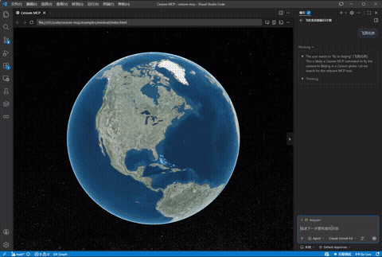

# cesium-mcp

**English** | [中文](README.zh-CN.md)

MCP ([Model Context Protocol](https://modelcontextprotocol.io/)) integration for [CesiumJS](https://cesium.com/) — let AI agents control a 3D globe through natural language.

**Website**: [gaopengbin.github.io/cesium-mcp](https://gaopengbin.github.io/cesium-mcp/)

[](LICENSE)
[](https://github.com/gaopengbin/cesium-mcp/actions/workflows/ci.yml)
[](https://www.npmjs.com/package/cesium-mcp-bridge)
[](https://www.npmjs.com/package/cesium-mcp-runtime)
[](https://www.npmjs.com/package/cesium-mcp-dev)

## Packages

| Package | Description | npm |
|---------|-------------|-----|
| [cesium-mcp-bridge](packages/cesium-mcp-bridge/) | Browser SDK — embeds in your CesiumJS app, receives commands via WebSocket | [](https://www.npmjs.com/package/cesium-mcp-bridge) |
| [cesium-mcp-runtime](packages/cesium-mcp-runtime/) | MCP Server (stdio) — exposes 19 tools + 2 resources to any MCP client | [](https://www.npmjs.com/package/cesium-mcp-runtime) |
| [cesium-mcp-dev](packages/cesium-mcp-dev/) | IDE MCP Server — CesiumJS API helper for coding assistants | [](https://www.npmjs.com/package/cesium-mcp-dev) |

## Architecture

```
┌──────────────┐   stdio    ┌──────────────────┐  WebSocket  ┌──────────────────┐
│  AI Agent    │ ◄────────► │  cesium-mcp-     │ ◄─────────► │  cesium-mcp-     │
│  (Claude,    │   MCP      │  runtime         │   JSON-RPC  │  bridge          │
│   Cursor…)   │            │  (Node.js)       │             │  (Browser)       │
└──────────────┘            └──────────────────┘             └──────────────────┘
                                                                     │
                                                              ┌──────▼──────┐
                                                              │  CesiumJS   │
                                                              │  Viewer     │
                                                              └─────────────┘
```

## Quick Start

### 1. Install the bridge in your CesiumJS app

```bash
npm install cesium-mcp-bridge
```

```js
import { CesiumMcpBridge } from 'cesium-mcp-bridge';

const bridge = new CesiumMcpBridge(viewer, { port: 9100 });
bridge.connect();
```

### 2. Start the MCP runtime

```bash
npx cesium-mcp-runtime
```

### 3. Connect your AI agent

Add to your MCP client config (e.g. Claude Desktop):

```json
{
  "mcpServers": {
    "cesium": {
      "command": "npx",
      "args": ["-y", "cesium-mcp-runtime"]
    }
  }
}
```

Now ask your AI: *"Fly to the Eiffel Tower and add a red marker"*

## 19 Available Tools

| Category | Tools |
|----------|-------|
| Camera | `fly_to`, `get_camera` |
| Layers | `add_geojson`, `add_tileset`, `add_terrain`, `add_imagery`, `remove_layer`, `get_layers` |
| Markers | `add_marker` |
| Drawing | `draw_shape` |
| Measurement | `measure` |
| Heatmap | `add_heatmap` |
| Interaction | `highlight`, `screenshot` |
| Scene | `set_scene_style`, `get_scene_info` |
| Query | `coord_pick`, `feature_query`, `spatial_query` |
| Analysis | `viewshed_analysis` |

## Demo



## Examples

See [examples/minimal/](examples/minimal/) for a complete working demo with all 19 commands.

## Development

```bash
git clone https://github.com/gaopengbin/cesium-mcp.git
cd cesium-mcp
npm install
npm run build
```

## Version Policy

The major.minor version tracks CesiumJS (e.g. `1.139.x` targets Cesium `~1.139.0`). Patch versions are independent for MCP feature iterations.

## License

MIT
