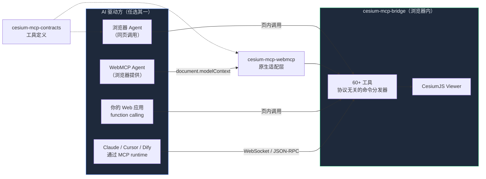

<div align="center">
  

  <h1>Cesium MCP</h1>

  <p><strong>给 CesiumJS 加 AI 命令的最小代价</strong></p>

  <p><a href="packages/cesium-mcp-bridge/">cesium-mcp-bridge</a> 是协议无关的 Cesium 命令执行核心；独立适配层可将它接入 <strong>纯浏览器 Agent</strong>、<strong>WebMCP 浏览器 Agent</strong>、<strong>function calling</strong> 或 <strong>MCP</strong>。</p>

  <p>四种接入方式任选其一：<a href="examples/browser-agent/">浏览器 Agent</a>（最简单，零后端）· WebMCP（页面内浏览器工具）· function calling（自托管 Web 应用嵌入）· <a href="packages/cesium-mcp-runtime/">MCP runtime</a>（接 Claude Desktop / Cursor / Dify）</p>

  <p><a href="https://cesium-browser-agent.pages.dev/"><strong>立即体验</strong></a> — 在线 Demo，零安装、零注册</p>

  <p>
    <a href="https://gaopengbin.github.io/cesium-mcp/">官方网站</a> &middot;
    <a href="README.md">English</a> &middot;
    <a href="https://gaopengbin.github.io/cesium-mcp/zh-CN/guide/getting-started.html">快速入门</a> &middot;
    <a href="https://gaopengbin.github.io/cesium-mcp/zh-CN/api/bridge.html">API 文档</a>
  </p>

  <p>
    <a href="LICENSE"></a>
    <a href="https://github.com/gaopengbin/cesium-mcp/actions/workflows/ci.yml"></a>
    <a href="https://github.com/gaopengbin/cesium-mcp/stargazers"></a>
    <a href="https://www.npmjs.com/package/cesium-mcp-runtime"></a>
  </p>

  <p>
    <a href="https://www.npmjs.com/package/cesium-mcp-bridge"></a>
    <a href="https://www.npmjs.com/package/cesium-mcp-runtime"></a>
    <a href="https://www.npmjs.com/package/cesium-mcp-dev"></a>
  </p>
</div>

---

## 演示

https://github.com/user-attachments/assets/8a40565a-fcdd-47bf-ae67-bc870611c908

## 包与入口

| 模块 | 角色 | 状态 | 链接 |
|------|------|------|------|
| **cesium-mcp-contracts** | 与传输无关的浏览器工具名称、说明和 JSON Schema | 新增共享层 | [源码](packages/cesium-mcp-contracts/) |
| **cesium-mcp-bridge** | 与协议、传输无关的 Cesium 命令执行核心（60+ 命令） | 主线，持续迭代 | [](https://www.npmjs.com/package/cesium-mcp-bridge) · [源码](packages/cesium-mcp-bridge/) |
| **cesium-mcp-webmcp** | 基于原生 `document.modelContext` 的 Cesium 工具适配层 | 新增浏览器适配层 | [源码](packages/cesium-mcp-webmcp/) |
| **examples/webmcp-integration** | 不包含聊天 UI 和 MCP 服务的 npm + Vite 接入示例 | 开发者示例 | [示例](examples/webmcp-integration/) |
| **examples/browser-agent** | 纯浏览器 AI Agent，自动暴露 WebMCP 工具 | 推荐入口 | [示例](examples/browser-agent/) · [在线 demo](https://cesium-browser-agent.pages.dev/) |
| **cesium-mcp-runtime** | MCP 服务器（stdio + HTTP） | 稳定，按需更新 | [](https://www.npmjs.com/package/cesium-mcp-runtime) · [源码](packages/cesium-mcp-runtime/) |
| **cesium-mcp-dev** | 给代码助手用的 CesiumJS API 知识库 | 维护中 | [](https://www.npmjs.com/package/cesium-mcp-dev) · [源码](packages/cesium-mcp-dev/) |

> **怎么选？** 个人项目或想最快试用 → browser-agent；让兼容浏览器的 Agent 发现页面内 Cesium 工具 → WebMCP；已有 Web 应用要嵌 AI 助手 → bridge + 自己接 function calling；要从 Claude Desktop / Cursor / Dify 调用 → MCP runtime。

## 架构



bridge 保持为执行核心，工具契约和协议适配层分别独立。四种驱动方最终都调用同一个 Cesium 命令层，按场景选一种即可。在支持 WebMCP 的浏览器中，`cesium-mcp-webmcp` 可通过 `document.modelContext` 按 12 个工具集暴露 61 个浏览器安全命令，无需增加 MCP 传输层或后端服务器。

## 快速开始

### 路径 0 — 30 秒体验（浏览器 Agent，推荐）

打开 [在线 demo](https://cesium-browser-agent.pages.dev/) 直接提问；托管模型已经就绪，浏览器无需填写 API key：
> *“飞到埃菲尔铁塔，放个红色标记”*

Fork [examples/browser-agent](examples/browser-agent/) 部署你自己的。

### 路径 1 — 通过 WebMCP 暴露 Cesium 工具（Chrome 149+ 实验功能）

browser-agent 示例会在检测到 `document.modelContext` 时，自动注册全部 61 个浏览器安全页面工具；内置聊天默认通过工具集自动调度，把常规请求控制在 20 个以内，同时保留核心、单工具集和全部 61 个工具模式：

```bash
npm run build -w packages/cesium-mcp-bridge
npm run build -w packages/cesium-mcp-webmcp
npx serve . -l 4173
```

打开 `http://localhost:4173/examples/browser-agent/`，点击 **Start**，然后在 DevTools → Application → WebMCP 中查看或执行工具。本地测试需在 `chrome://flags` 中启用 `#enable-webmcp-testing` 和 `#devtools-webmcp-support`。

应用开发者需要单独安装适配包；普通用户只需打开已经接入的网站，不需要安装 npm 包，也不需要启动 MCP 服务。

```bash
npm install cesium cesium-mcp-bridge cesium-mcp-webmcp
```

```js
import { CesiumBridge } from 'cesium-mcp-bridge'
import { registerCesiumWebMcp } from 'cesium-mcp-webmcp'

const bridge = new CesiumBridge(viewer)
const registration = await registerCesiumWebMcp(bridge, {
  toolsets: 'all',
  excludeTools: ['geocode'], // 如需该工具，请接入自己的浏览器地理编码处理器
})

// 页面卸载时可注销：
registration.unregister()
```

自定义集成见 [WebMCP 适配包 API](packages/cesium-mcp-webmcp/README.md)。
完整 npm + Vite 应用可直接参考 [WebMCP 接入示例](examples/webmcp-integration/)。

### 路径 2 — 嵌进你的 Web 应用（function calling）

```bash
npm install cesium-mcp-bridge
```

```js
import { CesiumBridge } from 'cesium-mcp-bridge';

const bridge = new CesiumBridge(viewer);
// 然后：把 bridge 的工具 schema 交给任何支持 function/tool calling 的 LLM，
// 把模型返回的 tool call 路由到 bridge.execute(name, params) 即可。
```

完整闭环示例：[examples/browser-agent/index.html](examples/browser-agent/index.html)。

### 路径 3 — 从 Claude Desktop / Cursor / Dify 调用（MCP）

按路径 2 安装 bridge，然后启动 MCP runtime：

```bash
# stdio 模式（Claude Desktop、VS Code、Cursor）
npx cesium-mcp-runtime

# HTTP 模式（Dify、远程/云端 MCP 客户端）
npx cesium-mcp-runtime --transport http --port 3000
```

MCP 客户端配置：

```json
{
  "mcpServers": {
    "cesium": {
      "command": "npx",
      "args": ["-y", "cesium-mcp-runtime"]
    }
  }
}
```

## 58 个可用工具

工具按 **12 个工具集** 组织。默认启用 4 个核心工具集（约 31 个工具）。设置 `CESIUM_TOOLSETS=all` 启用全部，或由 AI 在运行时动态按需发现和激活。

> **国际化**: 工具描述默认英文，设置 `CESIUM_LOCALE=zh-CN` 切换中文。

| 工具集 | 工具 |
|--------|------|
| **view** (默认) | `flyTo`, `setView`, `getView`, `zoomToExtent`, `saveViewpoint`, `loadViewpoint`, `listViewpoints`, `exportScene` |
| **entity** (默认) | `addMarker`, `addLabel`, `addModel`, `addPolygon`, `addPolyline`, `updateEntity`, `removeEntity`, `batchAddEntities`, `queryEntities`, `getEntityProperties` |
| **layer** (默认) | `addGeoJsonLayer`, `listLayers`, `removeLayer`, `clearAll`, `setLayerVisibility`, `updateLayerStyle`, `getLayerSchema`, `setBasemap` |
| **interaction** (默认) | `screenshot`, `highlight`, `measure` |
| camera | `lookAtTransform`, `startOrbit`, `stopOrbit`, `setCameraOptions` |
| entity-ext | `addBillboard`, `addBox`, `addCorridor`, `addCylinder`, `addEllipse`, `addRectangle`, `addWall` |
| animation | `createAnimation`, `controlAnimation`, `removeAnimation`, `listAnimations`, `updateAnimationPath`, `trackEntity`, `controlClock`, `setGlobeLighting` |
| tiles | `load3dTiles`, `loadTerrain`, `loadImageryService`, `loadCzml`, `loadKml` |
| trajectory | `playTrajectory` |
| heatmap | `addHeatmap` |
| scene | `setSceneOptions`, `setPostProcess` |
| geolocation | `geocode` |

> **与 CesiumGS 官方 MCP 服务器的关系**：`camera`、`entity-ext` 和 `animation` 工具集原生融合了 [CesiumGS/cesium-mcp-server](https://github.com/CesiumGS/cesium-mcp-server)（Camera Server、Entity Server、Animation Server）的能力到本项目的统一 Bridge 架构中。一个 MCP 服务器即可获得全部官方功能加更多工具，无需运行多个进程。

## 示例

查看 [examples/minimal/](examples/minimal/) 获取完整工作示例。

## 开发

```bash
git clone https://github.com/gaopengbin/cesium-mcp.git
cd cesium-mcp
npm install
npm run build
```

## 版本策略

版本格式：`{Cesium主版本}.{Cesium次版本}.{MCP补丁号}`

| 版本段 | 含义 | 示例 |
|--------|------|------|
| `1.143` | 跟踪 CesiumJS 版本 — 基于 Cesium `~1.143.0` 构建与测试 | `1.143.0` → Cesium 1.143 |
| `.x` | MCP 补丁号 — 独立迭代，用于新增工具、缺陷修复、文档更新 | `1.143.0` → `1.143.1` |

CesiumJS 官方发布新版本后，项目会先核对 Bridge API 和契约行为，再决定是否提升兼容基线，不会未经验证自动跟随最新版。

## 相关项目

- [mapbox-mcp](https://github.com/gaopengbin/mapbox-mcp) — AI 控制 Mapbox GL JS
- [openlayers-mcp](https://github.com/gaopengbin/openlayers-mcp) — AI 控制 OpenLayers

## Star 趋势

<a href="https://star-history.com/#gaopengbin/cesium-mcp&Date">
 <picture>
   <source media="(prefers-color-scheme: dark)" srcset="https://api.star-history.com/svg?repos=gaopengbin/cesium-mcp&type=Date&theme=dark" />
   <source media="(prefers-color-scheme: light)" srcset="https://api.star-history.com/svg?repos=gaopengbin/cesium-mcp&type=Date" />
   
 </picture>
</a>

## 许可证

[MIT](LICENSE)
