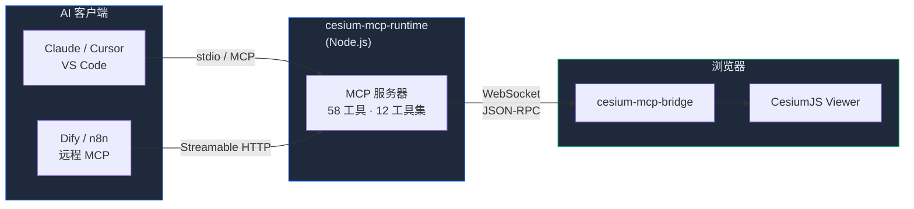

<div align="center">
  

  <h1>Cesium MCP</h1>

  <p><strong>通过模型上下文协议，用 AI 操控三维地球</strong></p>

  <p>将任何 MCP 兼容的 AI 智能体接入 <a href="https://cesium.com/">CesiumJS</a> — 相机、图层、实体、空间分析，全部通过自然语言完成。</p>

  <p>
    <a href="https://gaopengbin.github.io/cesium-mcp/">官方网站</a> &middot;
    <a href="README.md">English</a> &middot;
    <a href="https://gaopengbin.github.io/cesium-mcp/zh-CN/guide/getting-started.html">快速入门</a> &middot;
    <a href="https://gaopengbin.github.io/cesium-mcp/zh-CN/api/bridge.html">API 文档</a>
  </p>

  <p>
    <a href="LICENSE"></a>
    <a href="https://github.com/gaopengbin/cesium-mcp/actions/workflows/ci.yml"></a>
    <a href="https://github.com/gaopengbin/cesium-mcp/stargazers"></a>
    <a href="https://www.npmjs.com/package/cesium-mcp-runtime"></a>
  </p>

  <p>
    <a href="https://www.npmjs.com/package/cesium-mcp-bridge"></a>
    <a href="https://www.npmjs.com/package/cesium-mcp-runtime"></a>
    <a href="https://www.npmjs.com/package/cesium-mcp-dev"></a>
  </p>

  <p>
    <a href="https://img.shields.io/badge/tools-58-12B76A?style=flat-square"></a>
    <a href="https://img.shields.io/badge/toolsets-12-16B364?style=flat-square"></a>
    <a href="https://img.shields.io/badge/transport-stdio%20%7C%20http-7A5AF8?style=flat-square"></a>
    <a href="https://img.shields.io/badge/i18n-en%20%7C%20zh--CN-F79009?style=flat-square"></a>
  </p>

  <p>
    <a href="https://glama.ai/mcp/servers/gaopengbin/cesium-mcp"></a>
    <a href="https://mcpservers.org/servers/gaopengbin/cesium-mcp"></a>
    <a href="https://smithery.ai/server/gaopengbin/cesium-mcp-runtime"></a>
  </p>
</div>

---

## 演示

https://github.com/user-attachments/assets/8a40565a-fcdd-47bf-ae67-bc870611c908

## 包

| 包名 | 描述 | npm |
|------|------|-----|
| [cesium-mcp-bridge](packages/cesium-mcp-bridge/) | 浏览器 SDK — 嵌入你的 CesiumJS 应用，通过 WebSocket 接收命令 | [](https://www.npmjs.com/package/cesium-mcp-bridge) |
| [cesium-mcp-runtime](packages/cesium-mcp-runtime/) | MCP 服务器 (stdio + HTTP) — 58 个工具（12 个工具集）+ 2 个资源，支持动态发现 | [](https://www.npmjs.com/package/cesium-mcp-runtime) |
| [cesium-mcp-dev](packages/cesium-mcp-dev/) | IDE MCP 服务器 — 为代码助手提供 CesiumJS API 辅助 | [](https://www.npmjs.com/package/cesium-mcp-dev) |

## 架构



## 快速开始

### 1. 在你的 CesiumJS 应用中安装 bridge

```bash
npm install cesium-mcp-bridge
```

```js
import { CesiumBridge } from 'cesium-mcp-bridge';

const bridge = new CesiumBridge(viewer);
```

### 2. 启动 MCP 运行时

```bash
# stdio 模式（默认 — 用于 Claude Desktop、VS Code、Cursor）
npx cesium-mcp-runtime

# HTTP 模式（用于 Dify、远程/云端 MCP 客户端）
npx cesium-mcp-runtime --transport http --port 3000
```

### 3. 连接你的 AI 智能体

在 MCP 客户端配置中添加（如 Claude Desktop）：

```json
{
  "mcpServers": {
    "cesium": {
      "command": "npx",
      "args": ["-y", "cesium-mcp-runtime"]
    }
  }
}
```

然后对 AI 说：*"飞到埃菲尔铁塔，添加一个红色标记"*

## 58 个可用工具

工具按 **12 个工具集** 组织。默认启用 4 个核心工具集（约 31 个工具）。设置 `CESIUM_TOOLSETS=all` 启用全部，或由 AI 在运行时动态按需发现和激活。

> **国际化**: 工具描述默认英文，设置 `CESIUM_LOCALE=zh-CN` 切换中文。

| 工具集 | 工具 |
|--------|------|
| **view** (默认) | `flyTo`, `setView`, `getView`, `zoomToExtent`, `saveViewpoint`, `loadViewpoint`, `listViewpoints`, `exportScene` |
| **entity** (默认) | `addMarker`, `addLabel`, `addModel`, `addPolygon`, `addPolyline`, `updateEntity`, `removeEntity`, `batchAddEntities`, `queryEntities`, `getEntityProperties` |
| **layer** (默认) | `addGeoJsonLayer`, `listLayers`, `removeLayer`, `clearAll`, `setLayerVisibility`, `updateLayerStyle`, `getLayerSchema`, `setBasemap` |
| **interaction** (默认) | `screenshot`, `highlight`, `measure` |
| camera | `lookAtTransform`, `startOrbit`, `stopOrbit`, `setCameraOptions` |
| entity-ext | `addBillboard`, `addBox`, `addCorridor`, `addCylinder`, `addEllipse`, `addRectangle`, `addWall` |
| animation | `createAnimation`, `controlAnimation`, `removeAnimation`, `listAnimations`, `updateAnimationPath`, `trackEntity`, `controlClock`, `setGlobeLighting` |
| tiles | `load3dTiles`, `loadTerrain`, `loadImageryService`, `loadCzml`, `loadKml` |
| trajectory | `playTrajectory` |
| heatmap | `addHeatmap` |
| scene | `setSceneOptions`, `setPostProcess` |
| geolocation | `geocode` |

> **与 CesiumGS 官方 MCP 服务器的关系**：`camera`、`entity-ext` 和 `animation` 工具集原生融合了 [CesiumGS/cesium-mcp-server](https://github.com/CesiumGS/cesium-mcp-server)（Camera Server、Entity Server、Animation Server）的能力到本项目的统一 Bridge 架构中。一个 MCP 服务器即可获得全部官方功能加更多工具，无需运行多个进程。

## 示例

查看 [examples/minimal/](examples/minimal/) 获取完整工作示例。

## 开发

```bash
git clone https://github.com/gaopengbin/cesium-mcp.git
cd cesium-mcp
npm install
npm run build
```

## 版本策略

版本格式：`{Cesium主版本}.{Cesium次版本}.{MCP补丁号}`

| 版本段 | 含义 | 示例 |
|--------|------|------|
| `1.139` | 跟踪 CesiumJS 版本 — 基于 Cesium `~1.139.0` 构建与测试 | `1.139.8` → Cesium 1.139 |
| `.8` | MCP 补丁号 — 独立迭代，用于新增工具、缺陷修复、文档更新 | `1.139.7` → `1.139.8` |

当 CesiumJS 发布新次版本（如 1.140）时，我们将同步升级：`1.140.0`。

## 相关项目

- [mapbox-mcp](https://github.com/gaopengbin/mapbox-mcp) — AI 控制 Mapbox GL JS
- [openlayers-mcp](https://github.com/gaopengbin/openlayers-mcp) — AI 控制 OpenLayers

## Star 趋势

<a href="https://star-history.com/#gaopengbin/cesium-mcp&Date">
 <picture>
   <source media="(prefers-color-scheme: dark)" srcset="https://api.star-history.com/svg?repos=gaopengbin/cesium-mcp&type=Date&theme=dark" />
   <source media="(prefers-color-scheme: light)" srcset="https://api.star-history.com/svg?repos=gaopengbin/cesium-mcp&type=Date" />
   
 </picture>
</a>

## 许可证

[MIT](LICENSE)
