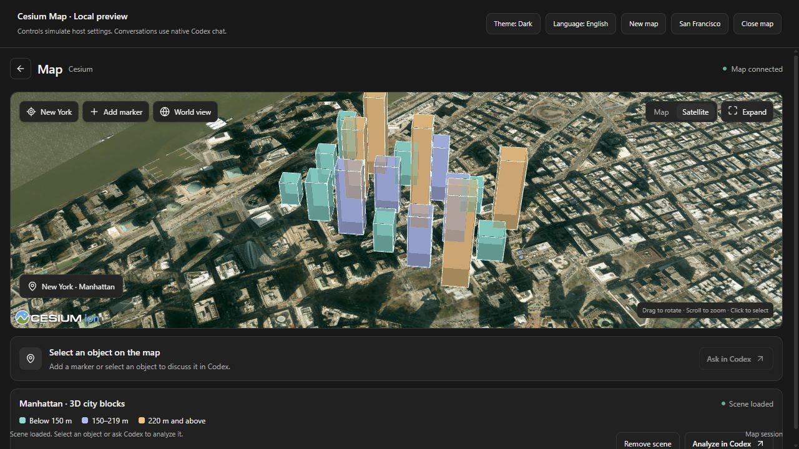
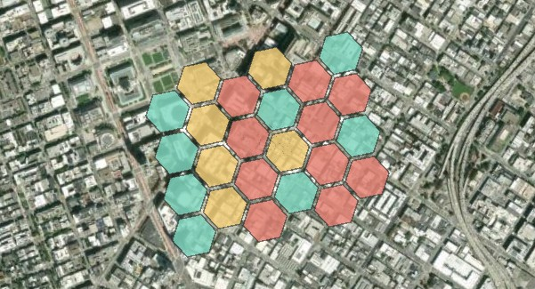
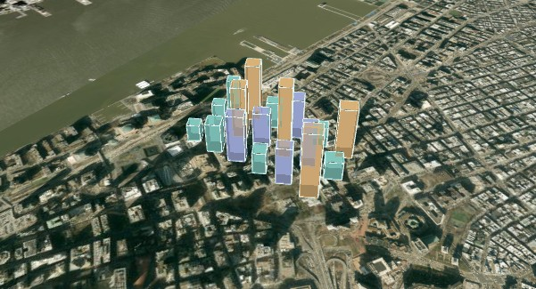
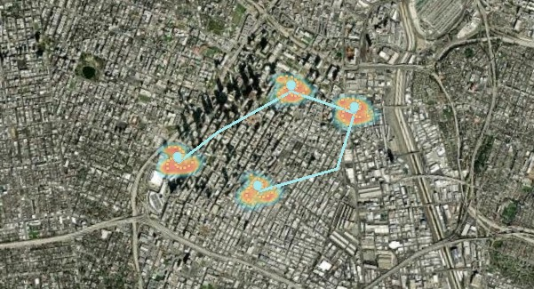

# Cesium Map for Codex

[中文安装说明](README.zh-CN.md) · [Website](https://laogao.xyz/cesium-map/) · [Support](https://laogao.xyz/cesium-map/support.html)

Explore and edit a Cesium 3D map from your native Codex conversation. The map follows the host theme and language, includes illustrative US scenes, and supports camera navigation, markers, GeoJSON, selected-object inspection, building extrusion and actual screenshots.

This community beta connects to the hosted HTTPS MCP service. It does not start a local map server or require a separate model API key. It has not been submitted to or approved for the OpenAI public plugin directory.

## Install from this repository

Use a current official Codex CLI with plugin marketplace support:

```text
codex plugin marketplace add gaopengbin/cesium-mcp --ref main
codex plugin add cesium-map@cesium-community
```

Restart Codex and start a new conversation. If you prefer the desktop plugin directory, add the source with the first command, then select **Cesium Map Community → Cesium Map → Install** in the plugin directory.

On Windows, an older `codex` on PATH may lack these commands. Update the official CLI or use the CLI bundled with the installed Codex desktop app. The [ZIP release](https://github.com/gaopengbin/cesium-mcp/releases/tag/cesium-map-plugin-v0.1.0) also includes a tested Windows source-registration script.

The host must support custom plugin sources, MCP Apps, WebGL and workers. Source registration and package installation were tested with the current Codex desktop CLI. A CLI installation result alone does not verify the map panel in every desktop version. If the map is unavailable, report the client version and error through the support page.

If a local Cesium Map development plugin is already enabled, disable that copy before using the community version to avoid duplicate map tools.

## Try it

- “Open a map of Manhattan, then add a marker near City Hall.”
- “Load this GeoJSON and explain the selected feature.”
- “Open the New York 3D city blocks scene, change the selected building height to 180 metres, then read it back.”

Conversations use the native host chat. Click an object and choose **Ask in Codex** to send its current map context. The host controls conversation placement and expansion; this plugin does not add a second chat panel.

Generated buildings, heatmap points and activity values in the US scenes are demonstration data, not surveyed building heights or official statistics. Imagery is provided by the selected third-party basemap provider.

## Map previews



Actual running screenshot: the development preview is connected to the hosted HTTPS MCP service. The native conversation UI is provided by Codex; it is not pictured here.

| San Francisco · City activity | New York · 3D city blocks | Los Angeles · Hotspots |
| --- | --- | --- |
|  |  |  |
| Inspect feature values and change classification colors | Select buildings, edit extrusion heights and read back properties | Combine a heatmap, markers and connecting routes |

These covers come from rendered map scenes. Buildings, activity values and heatmap points are demonstration data, not surveyed heights or official statistics. Basemap imagery: Esri and its imagery contributors.

## Service and privacy

The MCP endpoint is `https://laogao.xyz/cesium-map/mcp`. Every map operation requires the map's issued `sessionId`. Treat this value as a temporary bearer access credential and do not share it. Maps expire after 30 minutes of inactivity or 24 hours total. Public service capacity and payload limits apply.

[Privacy](https://laogao.xyz/cesium-map/privacy.html) · [Terms](https://laogao.xyz/cesium-map/terms.html) · [Developer verification walkthrough](https://laogao.xyz/cesium-map/review/)

## Update or remove

```text
codex plugin marketplace upgrade cesium-community
codex plugin add cesium-map@cesium-community
```

Restart Codex after refreshing or reinstalling the plugin. To remove it:

```text
codex plugin remove cesium-map@cesium-community
codex plugin marketplace remove cesium-community
```

This package distributes the hosted service connection, original SVG icons and map-operation skill. The published npm runtime has its own release lifecycle; installing this plugin does not update it.

[Official custom-source documentation](https://developers.openai.com/plugins/build/plugins)
